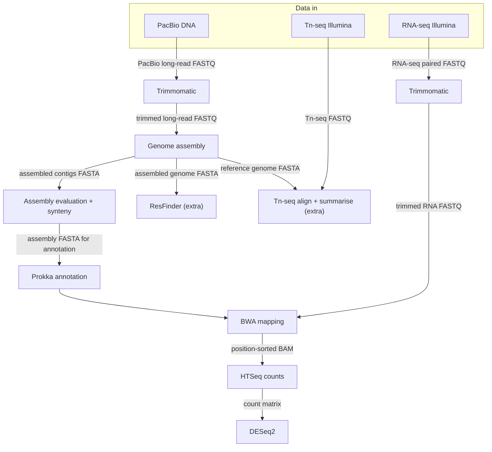

# Project plan — Paper I (Zhang et al. 2017)

**Course:** Genome Analysis labs (Student Manual 2026)  
**Paper:** RNA-seq and Tn-seq reveal fitness determinants of vancomycin-resistant *Enterococcus faecium* during growth in human serum (*BMC Genomics* 2017; data: ENA **PRJEB19025**, assembly **CP014529–CP014535**).

---

## 1. Aim and research questions

**Broad aim:** Re-analyse **public reads** using the **course Paper I workflow** (PacBio-based assembly, RNA-seq mapping, counting, DESeq2, extra questions), document commands and decisions in **GitHub**, and **compare** results to the **published E745** assembly and to **Zhang et al.’s biological conclusions** (serum growth, DE, Tn-seq fitness themes). The goal is **not** to exactly reproduce every author method.

**Course assembly vs the paper:** Zhang et al. closed the genome with **Illumina + PacBio + MinION**; the manual’s basic path is **PacBio-only** long-read assembly (Flye or Canu). Differences from the reference (**CP014529–CP014535**) in **contiguity, plasmid fragmentation, or local structure** are therefore **expected**.

**Questions this project will answer**

1. How complete and structurally consistent is **my** PacBio-based genome assembly compared to the **published E745** reference?
2. Which genes are **differentially expressed** between growth in **rich medium (BHI)** and **heat-inactivated human serum**?
3. **Extra question:** What **antibiotic resistance** profile does the genome support (e.g. ResFinder), and how does that relate to a VRE clinical isolate?
4. **Extra question:** Which genes show **Tn-seq evidence** of contributing to fitness in **human serum vs BHI**, and does that overlap the paper’s key pathways (nucleotide biosynthesis, carbohydrate uptake)?

---

## 2. Analyses, order, software, and bottlenecks

Steps are listed in **execution order**. Runtimes in the third column were obtained  from [Student Manual 2026, **Appendix II**] where that appendix gives a **Paper I** value; otherwise the duration corresponds to guessed estimations.


| Order | Analysis                                         | Expected runtime                                                                                              | Software (+ notes)                                           |
| ----- | ------------------------------------------------ | ------------------------------------------------------------------------------------------------------------- | ------------------------------------------------------------ |
| 1     | Reads QC (raw)                                   | ~10 min [Appendix II]                                                                                         | FastQC                                                       |
| 2     | Trimming                                         | ~50 min **per file**, 1 core [Appendix II]                                                                    | Trimmomatic                                                  |
| 3     | Genome assembly (PacBio)                         | Canu **~2.5 h**, **4 cores** [Appendix II]                                                                    | Canu                                                         |
| 4     | Assembly evaluation                              | QUAST **under 15 min**, 1 core [Appendix II]                                                                  | QUAST                                                        |
| 5     | Structural + functional annotation               | **under 5 min**, 1 core [Appendix II]                                                                         | Prokka                                                       |
| 6     | Comparative genomics (synteny vs close relative) | BLAST **under 1 min**, **2 cores** [Appendix II]                                                              | MUMmerplot                                                   |
| 7     | RNA: map to **assembled genome**                 | **~30 min** paired-end, **1 core** [Appendix II]Single-end **under 15 min**, 1 core [Appendix II]           | BWA                                                          |
| 8     | Read counting                                    | HTSeq **~2–7 h** paired-end, **1 core** [Appendix II]HTSeq single-end **under 10 min**, 1 core [Appendix II] | HTSeq                                                        |
| 9     | Differential expression                          | **"usually a few minutes"** [Appendix II]                                                                     | DESeq2                                                       |
| 10    | **Extra:** Antibiotic resistance                 | Relatively quick                                                                                              | ResFinder (or course-equivalent); document database/version. |
| 11    | **Extra:** Tn-seq                                | **Similar to previous RNA Read Counting (now single end) and differential expression. Around 10mins**         | HTSeq + DESeq2                                               |


**Bottlenecks (from stated Appendix II Paper I times):** 

Longest **listed** Paper I steps are **HTSeq paired-end (2–7 h, 1 core)** and **Canu (~2.5 h, 4 cores)**; **Trimmomatic** scales with **number of FASTQ files** (~50 min per file, 1 core). Tn-seq and ResFinder times have **no**t yet been determined.

### Workflow diagram




---

## 3. Time frame and checkpoints


| Date (2026) | Checkpoint                                                                         |
| ----------- | ---------------------------------------------------------------------------------- |
| 10 Apr      | **Project plan** approved / updated on GitHub wiki                                 |
| 15–16 Apr   | **Genome assembly**                                                                |
| 21 Apr      | **Assembly evaluation + Annotation**                                               |
| 24 Apr      | Annotation (if still unfinished)                                                   |
| 28 Apr      | **Comparative genomics** (synteny)                                                 |
| 5 May       | **RNA trimming**                                                                   |
| 8 May       | **RNA mapping**                                                                    |
| 11 May      | **Read counting**                                                                  |
| 13 May      | **Differential expression**                                                        |
| 19 May      | Extra day: fix stuff / extra analysis specifics                                    |
| **22 May**  | **Wiki** complete: **extra analyses** (resistance + Tn-seq) documented for grade 5 |
| 26 May      | **Presentation** (slides on Studium per course rules)                              |

(Eventually I'll just do as much as possible everyday, the expected times are quite conservative)
---

## 4. Data types and storage

**Types of data**

- **DNA:** PacBio reads for assembly.
- **RNA-seq:** Illumina paired-end (BHI vs heat-inactivated serum, replicates as in SRA / paper).
- **Tn-seq:** single end.

**Storage**

- The manual does **not** give a total GB estimate for the whole Paper I project. It states UPPMAX **home** is limited to **32 Gb**, that large files should live under the **course project** (`/proj/uppmax2026-1-61/...`) with **symlinks** to individual files—not copying whole project FASTQs into home. Track quota.
- **GitHub:** code, documentation.

---

## 5. Data and repository organisation

**Working directory (example)**

```text
genome_analyses/
├── data/
│   ├── metadata/
│   │   └── samples.tsv          # one row per sample; .tsv or .csv; no merged cells
│   ├── raw_data/                # symlinks to /proj/.../Genome_Analysis/.../files
│   └── trimmed_data/            # if you produce trims locally
├── analyses/
│   ├── 01_qc/
│   ├── 02_assembly_pacbio/
│   ├── 03_eval_quast_busco/
│   ├── 04_annotation_prokka/
│   ├── 05_synteny/
│   ├── 06_rna_map_count/
│   ├── 07_deseq2/
│   ├── 08_resfinder/            # extra
│   └── 09_tnseq/                # extra
└── code/
    ├── sbatch_*.sh
    └── *.R / *.sh
```

**Metadata spreadsheet rules**

- One sample per row; one variable per column.  
- No merged cells; no spaces in column names (use `_` or `-`).  
- Consistent naming; export as `.tsv` or `.csv` (plain text, tab- or comma-separated).

---

## 6. Flexibility

- Extra questions might be modified during the project execution.
- Stuff might (will) go wrong at some point, it'll be properly logged.

