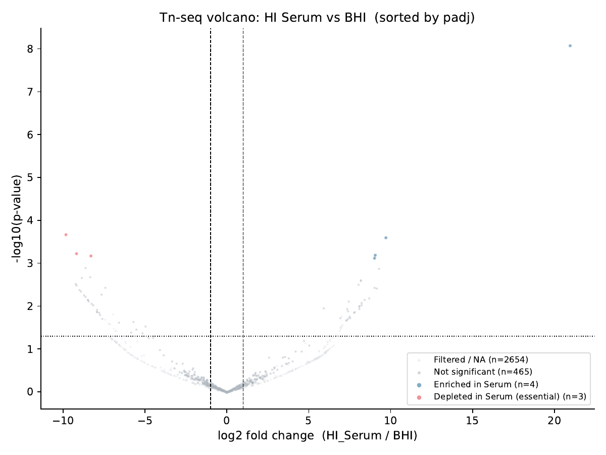
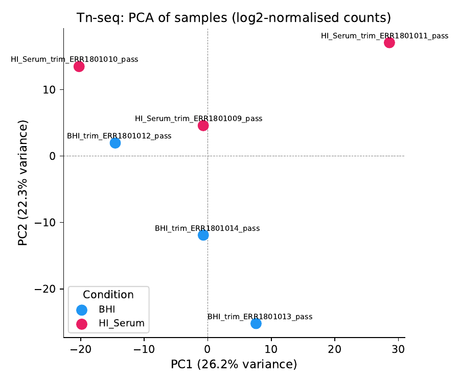

# Grade 5 Questions — Paper I: Zhang et al. 2017
Extra analyses: ResFinder (AMR) + Tn-seq (conditional essentiality)

---

## Extra Analysis 6 — Evaluating Antibiotic Resistance Potential (ResFinder)

**Q6.1. How many antibiotics is the strain predicted to be resistant to? And sensitive?**

E. faecium E745 is predicted to be **resistant to 6 antibiotics**: vancomycin, teicoplanin, ampicillin, ciprofloxacin, gentamicin, and erythromycin.

It is predicted to have **no resistance to 6 antibiotics**: fosfomycin, quinupristin+dalfopristin, tigecycline, tetracycline, linezolid, and chloramphenicol.

---

**Q6.2. Which mutation in the gene gyrA confers resistance to nalidixic acid and ciprofloxacin? And in the gene parC?**

**gyrA:** mutation **p.E87G** (GAG → GGG, Glu87Gly at codon 87) confers resistance to nalidixic acid and ciprofloxacin.

**parC:** mutation **p.S80I** (AGC → ATC, Ser80Ile at codon 80) confers resistance to nalidixic acid and ciprofloxacin.

Both GyrA and ParC are targets of fluoroquinolone antibiotics. These substitutions alter the drug-binding pocket of each enzyme, reducing fluoroquinolone binding affinity. The presence of mutations in both genes confers high-level quinolone resistance.

---

**Q6.3. Which mapping method uses ResFinder?**

ResFinder uses **BLAST** when an assembled genome in FASTA format is submitted. When raw reads (FASTQ) are submitted instead, it uses **KMA** (K-Mer Alignment), a faster k-mer based aligner suited for unassembled data. In this analysis, BLAST was used since the Canu assembly was submitted.

---

**Q6.4. Why is it important to evaluate the antibiotic resistance potential of a bacterial strain?**

It is key to know how to defend patients from bacterial infections. In this specific case:

1. E745 is **resistant to vancomycin** — the standard last-resort antibiotic for Gram-positive infections. Knowing this is essential to select an effective alternative.

2. **Infection control:** VRE (*vancomycin-resistant Enterococcus*) spreads easily in hospital settings. Characterising resistance profiles informs isolation and decontamination protocols.

3. **Epidemiology:** Identifying specific resistance mechanisms enables tracking of resistance spread between strains and hospitals.

4. Understanding the full resistance landscape of clinical strains in order to guide rational antibiotic use policies, avoiding risks.

---

## Extra Analysis 7 — Identify Essential Genes for Growth in Human Serum (Tn-seq)

**Q7.1. How did the authors get the data from the Tn-seq analysis? What type of data is it?**

The authors created a saturating transposon insertion library of *E. faecium* E745 by randomly inserting a transposon (a mobile DNA element) throughout the genome. Each insertion disrupts the gene it lands in. This library — containing thousands of individual mutants — was then grown competitively in two conditions: heat-inactivated human serum and BHI medium. After growth, the bacteria were harvested and the genomic DNA was sequenced (Illumina, single-end 50 nt reads) to quantify how many reads map to each transposon insertion site per gene. Samples used: ERR1801009/010/011 (HI Serum) and ERR1801012/013/014 (BHI), 3 biological replicates each.

It is **short-read Illumina sequencing data** (single-end) targeting transposon-flanking sequences to measure insertion abundance per gene across the genome.

---

**Q7.2. What is the goal of the Tn-seq analysis?**

The goal is to identify genes that are **conditionally essential** for growth specifically in human serum. If a gene is required for survival in serum, mutants with a transposon disrupting that gene will be selectively lost from the serum-grown population but will remain present in the BHI-grown population (where the gene is not needed). By comparing the abundance of transposon insertions per gene between serum and BHI using DESeq2, genes that are depleted in serum are identified as conditionally essential for serum growth. These represent potential adaptation mechanisms specific to the bloodstream environment.

---

**Q7.3. Which genes seem to be important for E. faecium to grow in human serum? Attach a plot that supports your conclusion, analyze it and explain briefly your workflow.**

DESeq2 (contrast: HI_Serum vs BHI, reference = BHI) identified **3 genes depleted in serum** (padj < 0.05, log2FC < -1), meaning these genes are conditionally essential for growth in human serum:

| Gene ID | log2FC | padj |
|---|---|---|
| LPCHMCBP_00934 | -9.80 | 0.039 |
| LPCHMCBP_01716 | -8.30 | 0.050 |
| LPCHMCBP_02043 | -9.17 | 0.050 |

An additional **4 genes were enriched in serum** (log2FC > 1, padj < 0.05), meaning their disruption confers a fitness advantage in serum — these probably encode functions that are costly or unnecessary in the bloodstream.

**Workflow summary:**
1. Tn-seq single-end reads mapped to Canu assembly with BWA mem (`scripts/extra_tnseq/12_tnseq_bwa.sh`)
2. Transposon insertion counts per gene with HTSeq-count using Prokka GFF (`scripts/extra_tnseq/12_tnseq_htseq.sh`)
3. Differential abundance analysis with DESeq2, contrast HI_Serum vs BHI (`scripts/extra_tnseq/13_tnseq_deseq.R`)
4. Visualisation with volcano plot, PCA, and count histogram (`scripts/extra_tnseq/14_tnseq_plot.py`)

The supporting plot is the **volcano plot** below. In the volcano plot, each point is a gene. Points to the left (negative log2FC) with high -log10(padj) represent genes depleted in serum — the 3 conditionally essential genes appear as significant points on the left side. Points to the right represent genes enriched in serum.

 The plot shows that only a small number of genes pass the significance threshold, indicating that most of the genome is not conditionally essential for serum growth under the tested conditions.

The low number of significant hits (3 essential genes) compared to published Tn-seq studies is likely due to limited transposon library coverage and the relatively small number of replicates (n=3), which reduces statistical power to detect moderate depletion effects. Despite this, the 3 identified genes are strong candidates for serum-specific survival factors in E745.
