# Genome Analysis 2026 - Lab Project Wiki — Paper I: Zhang et al. 2017
### *E. faecium* E745 — Genome Assembly, Annotation, RNA-seq & Differential Expression

**Author:** Jorge Garcia Pombo
**Course:** Genome Analysis, Uppsala University 2026  
**Repo:** [GitHub — Genome_Analysis_26](https://github.com/Jorge-G-P/Genome_Analysis_26)

---

## Table of Contents

0. [Key Results Summary](#0-key-results-summary)
1. [Project Overview](#1-project-overview)
2. [Project Plan & Data Management](#2-project-plan--data-management)
3. [Reads Quality Control — FastQC](#3-reads-quality-control--fastqc)
4. [Reads Preprocessing — Trimmomatic](#4-reads-preprocessing--trimmomatic)
5. [Genome Assembly — Canu](#5-genome-assembly--canu)
6. [Assembly Evaluation — QUAST](#6-assembly-evaluation--quast)
7. [Genome Annotation — Prokka](#7-genome-annotation--prokka)
8. [Synteny Analysis — MUMmerplot](#8-synteny-analysis--mummerplot)
9. [RNA-seq Mapping — BWA](#9-rna-seq-mapping--bwa)
10. [Read Counting — HTSeq](#10-read-counting--htseq)
11. [Differential Expression — DESeq2](#11-differential-expression--deseq2)
12. [Overall Conclusions](#12-overall-conclusions)

**Extra Analyses**

13. [Antibiotic Resistance — ResFinder](#13-antibiotic-resistance--resfinder)
14. [Tn-seq: Conditional Essentiality Screen](#14-tn-seq-conditional-essentiality-screen)

---

## 1. Project Overview

### The Paper

**Zhang X. et al. (2017).** *RNA-seq and Tn-seq reveal fitness determinants of vancomycin-resistant Enterococcus faecium during growth in human serum.*

*Enterococcus faecium* is a bacterium that normally lives harmlessly in the human gut. However, in some patients, it can escape the gut and enter the bloodstream, causing serious opportunistic infections. One of the reasons that makes strain E745 particularly concerning is its resistance to vancomycin — one of the last-resort antibiotics used against Gram-positive bacteria. Vancomycin-resistant *E. faecium* (VRE) is a major public health threat worldwide, and, therefore, understanding how it survives and grows in human blood is key to developing new treatments.

The authors used a combination of whole-genome sequencing (PacBio long reads), RNA-seq (Illumina short reads), and Tn-seq (transposon insertion sequencing) to characterise:
- The complete genome of *E. faecium* E745
- Which genes are differentially expressed when the bacterium grows in human serum versus a rich laboratory medium (BHI)
- Which genes are essential for growth specifically in human serum (identified by transposon disruption). (Extra analysis 2)

### Aims of This Project

In this project, the goal is to reproduce the core analyses from the paper using the same raw data, and evaluate whether the same biological conclusions can be obtained. More specifically:

1. Assemble the E745 genome from PacBio reads.
2. Evaluate assembly quality.
3. Annotate the genome.
4. Compare synteny with a closely related reference strain.
5. Pre-process Illumina RNA-seq reads and assess quality.
6. Map RNA-seq reads to the assembled genome.
7. Count reads per gene and identify differentially expressed genes between serum and BHI conditions.

??
Similarly to the paper, we hypothesise that some genes necessary for purine/pyrimidine biosynthesis are conditionally essential in serum and represent conserved virulence determinants across E. faecium strains. Doing the Tn-Seq analysis will prove the importance of this genes.

---

## 2. Project Plan & Data Management

### Data Sources

All raw sequencing data was provided by the course administrators, having pre-downloaded copies on UPPMAX at:

```
/proj/uppmax2026-1-61/Genome_Analysis/1_Zhang_2017/
```

Soft links to individual files were created in the working directory rather than copying the large raw files, as indicated in the Student Manual.

#### Sample Metadata

| SRA Accession | Type | Condition | Library | Reads |
|---|---|---|---|---|
| SRR2912679 | PacBio WGS | — | CLR long reads | ~160k reads, ~8.7 kb avg |
| ERR1797969 | Illumina RNA-seq | HI Serum rep 1 | Paired-end 50 nt | ~52M reads |
| ERR1797970 | Illumina RNA-seq | HI Serum rep 2 | Paired-end 50 nt | ~53M reads |
| ERR1797971 | Illumina RNA-seq | HI Serum rep 3 | Paired-end 50 nt | ~55M reads |
| ERR1797972 | Illumina RNA-seq | BHI rep 1 | Paired-end 50 nt | ~54M reads |
| ERR1797973 | Illumina RNA-seq | BHI rep 2 | Paired-end 50 nt | ~48M reads |
| ERR1797974 | Illumina RNA-seq | BHI rep 3 | Paired-end 50 nt | ~46M reads |

**Note:** FastQC was run only on Illumina reads. PacBio reads are long-read CLR data for which FastQC is not appropriate.

### Directory Structure (UPPMAX)

```
Genome_Analysis_26/
├── scripts/          # All SLURM batch scripts and analysis scripts
├── results/          # Small output files, logs, summary tables (tracked in git)
│   ├── 1_fastqc/
│   ├── 2_trimmomatic/
│   ├── 3_assembly/
│   ├── 3.5_quast/
│   ├── 4_prokka/
│   ├── 5_synteny/
│   ├── 6_bwa/
│   ├── 7_HTSeq/
│   └── 8_DESeq2/
│   └── E1_TnSeq_DESeq/
│   └── E2_resfinder/
│   └── plots/
├── data/             # Gitignored — raw data and large intermediate files
│   ├── 1_Zhang_2017/ # Raw reads (soft links to project folder)
│   └── tmp/          # Intermediate outputs needed for the pipeline (BAMs, trimmed reads, etc.)
└── errors/           # Slurm error logs.
└── outputs/          # Slurm output logs.
└── wiki.md           # This document, then also uploaded in the github wiki site.
```

### Analysis Workflow

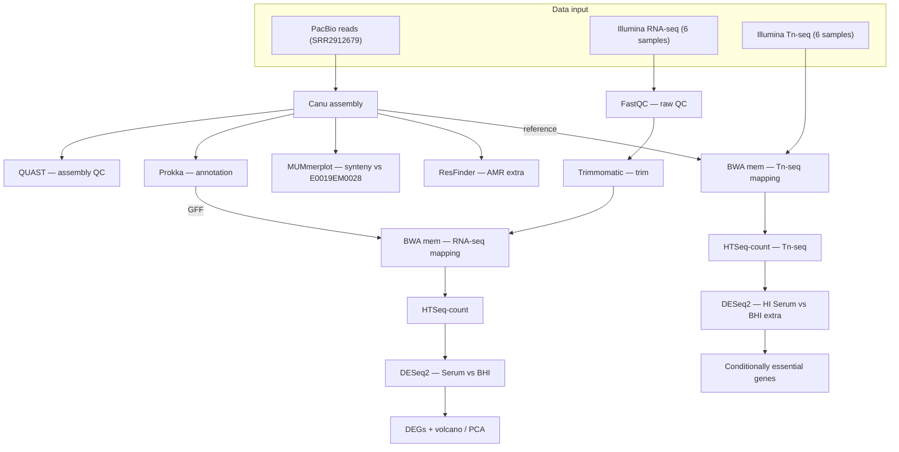

### Pipeline Execution Timeline

> Approximate dates for each main task of the project.

| Step | Script | Approx. date | Key output |
|---|---|---|---|
| 1. FastQC (raw) | `scripts/1_fastqc_illumina.sh` | 2026-05-15 | `results/1_fastqc/` — 12 HTML reports |
| 2. Genome assembly | `scripts/2_assembly_nogrid.sh` | 2026-04-15 | `data/tmp/2_canu_assembly/paper1_e745.contigs.fasta` |
| 3. Assembly QC | `scripts/3_quast.sh` | 2026-04-21 | `results/3.5_quast/report.txt` |
| 4. Annotation | `scripts/4_prokka.sh` | 2026-04-21 | `results/4_prokka/paper1.*` |
| 5. Synteny | `scripts/5_synteny_mummer.sh` | 2026-05-21 | `results/5_synteny/mummerplot.png` |
| 6. Trimmomatic BHI | `scripts/6_trim_rna_BH.sh` | 2026-05-05 | `data/tmp/5_trim_rna/bh/` |
| 6b. Trimmomatic Serum | `scripts/6.2_trim_rna_Serum.sh` | 2026-05-05 | `data/tmp/5_trim_rna/serum/` |
| 7. BWA mapping | `scripts/7_bwa_rnamap.sh` | 2026-05-08 | `data/tmp/7_bwa_rna/` — 6 BAMs + flagstat/coverage |
| 8. HTSeq-count | `scripts/8_htseq.sh` | 2026-05-11 | `data/tmp/8_htseq_counts/` — 6 count tables |
| 9. DESeq2 | `scripts/9_deseq2.R` | 2026-05-13 | `results/8_DESeq2/` — CSVs + PDFs |
| 10. DESeq2 plots | `scripts/10_plot_DESeq.py` | 2026-05-13 | `results/8_DESeq2/plot_*.pdf` |
| E1. Tn-seq mapping | `scripts/extra_tnseq/12_tnseq_bwa.sh` | 2026-05-20 | `data/tmp/12_tnseq_bwa/` |
| E2. Tn-seq HTSeq | `scripts/extra_tnseq/12_tnseq_htseq.sh` | 2026-05-20 | `data/tmp/12_tnseq_htseq/` |
| E3. Tn-seq DESeq2 | `scripts/extra_tnseq/13_tnseq_deseq.R` | 2026-05-20 | `results/E1_TnSeq_DESeq/` |
| E4. Tn-seq plots | `scripts/extra_tnseq/14_tnseq_plot.py` | 2026-05-20 | `results/E1_TnSeq_DESeq/tnseq_plot_*.pdf` |
| E5. ResFinder | Web tool (CGE server) | 2026-05-21 | `results/E2_resfinder/` |

---

## 3. Reads Quality Control — FastQC

### Methods

FastQC was run on all 12 raw Illumina RNA-seq FASTQ files (6 samples × 2 paired-end files each) prior to trimming. The goal was to assess base quality, adapter contamination, GC content distribution, and sequence duplication levels before any preprocessing.

```bash
# Script: scripts/1_fastqc_illumina.sh
module load FastQC/0.12.1
fastqc -o data/tmp/1_fastqc/ -t 2 data/1_Zhang_2017/transcriptomics_data/RNA-Seq_*/raw/*.fastq.gz
```

Reports are stored in `results/1_fastqc/` (HTML + ZIP per sample).

### Results & Discussion

All 12 samples passed the critical quality modules (per-base sequence quality, per-sequence quality scores, per-base N content, sequence length distribution), with Phred scores > 30 across most positions. However, several modules showed failures that are expected and well-understood in the context of bacterial RNA-seq:

- **Adapter Content (FAIL, 12/12 samples):** TruSeq Illumina adapters are present in all samples, as expected from the library preparation protocol. This is not a data quality problem — it is the reason Trimmomatic is run next. Adapters will be removed in the preprocessing step.
- **Sequence Duplication Levels (FAIL, 12/12 samples):** High duplication is normal in RNA-seq data. Highly expressed genes produce many identical reads, and any rRNA not depleted during library prep is inherently repetitive. Unlike genomic DNA sequencing, duplicate reads in RNA-seq reflect real biology and are not removed.
- **Per base sequence content (FAIL, 9/12 samples):** The first ~10 bases show biased nucleotide composition, a well-documented artifact of random hexamer priming during cDNA synthesis. This does not affect downstream analyses.
- **Overrepresented sequences and Per sequence GC content (FAIL, 6/12 BHI samples only):** A secondary GC peak and overrepresented sequences were observed in the BHI replicates. This likely reflects rRNA contamination and/or highly expressed BHI-specific transcripts dominating the library.

Overall, the data quality is suitable for downstream analysis. The failures observed are expected artifacts of RNA-seq library preparation, not indicators of poor sequencing quality.

---

## 4. Reads Preprocessing — Trimmomatic

### Methods

Trimmomatic (v0.39) was used to remove adapter sequences and low-quality bases from all 6 paired-end RNA-seq samples. The tool was run in paired-end (`PE`) mode, which retains read pairing information — essential for downstream BWA paired-end alignment.

Even though trimming was performed, as indicated by the Student Manual, then the inputs used for the next steps of the analysis were taken from the provided already-trimmed samples. Course professors said that is okay as well, so the pre-trimmed ones were chosen in order to reduce the chances of introducing an error in the analysis.

Trimming parameters used:
- `ILLUMINACLIP:TruSeq3-PE.fa:2:30:10` — remove TruSeq3 adapters
- `LEADING:3` — remove leading bases with quality < 3
- `TRAILING:3` — remove trailing bases with quality < 3
- `SLIDINGWINDOW:4:15` — trim when 4-base window average quality drops below 15
- `MINLEN:36` — discard reads shorter than 36 bases after trimming

```bash
# Script: scripts/6_trim_rna_BH.sh, scripts/6.2_trim_rna_Serum.sh
# ERR1797971 rerun: scripts/6.2.2_trim_serum_ERR1797971.sh
trimmomatic PE -threads 2 -phred33 \
    ${SAMPLE}_1.fastq.gz ${SAMPLE}_2.fastq.gz \
    ${SAMPLE}_1P.fq.gz ${SAMPLE}_1U.fq.gz \
    ${SAMPLE}_2P.fq.gz ${SAMPLE}_2U.fq.gz \
    ILLUMINACLIP:TruSeq3-PE.fa:2:30:10 LEADING:3 TRAILING:3 \
    SLIDINGWINDOW:4:15 MINLEN:36
```

**Note on memory issues:** Initial runs with 4 threads caused `java.io.IOException: Resource temporarily unavailable` errors (gzip write thread exhaustion) when processing 3 samples in a loop. Samples were re-run individually with 1-2 threads to resolve this memory allocation issue. Rerun scripts were kept for the sake of having a more honest log history.

### Results

| Sample | Condition | Input pairs | Both surviving | % surviving | Dropped |
|---|---|---|---|---|---|
| ERR1797972 | BHI rep 1 | 27,078,884 | 14,397,580 | 53.17% | 4.68% |
| ERR1797973 | BHI rep 2 | 23,953,340 | 13,831,750 | 57.74% | 3.85% |
| ERR1797974 | BHI rep 3 | 23,240,177 | 12,544,127 | 53.98% | 4.65% |
| ERR1797969 | Serum rep 1 | 25,937,368 | 13,647,496 | 52.62% | 3.77% |
| ERR1797970 | Serum rep 2 | 26,634,380 | 15,334,022 | 57.57% | 4.22% |
| ERR1797971 | Serum rep 3 | 27,609,615 | 14,186,338 | 51.38% | 5.60% |

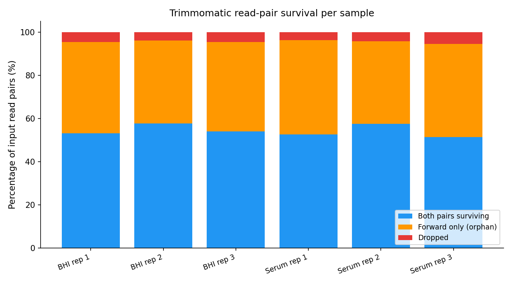

### Discussion

??
On average ~54% of read pairs survived trimming as properly paired. This relatively low survival rate (~50% vs the typical 70-90% for RNA-seq) is explained by the fact that many forward-only reads survive (`Forward Only Surviving` ~40-43%), but their reverse pair is discarded due to quality. This is a known characteristic of this dataset — the reverse reads are notably lower quality, likely due to a batch-specific sequencing issue. The paired surviving reads (~13-15M per sample) should still be well within a sufficient range for differential expression analysis in a ~3.1 Mb bacterial genome.

---

## 5. Genome Assembly — Canu

### Methods

The *E. faecium* E745 genome was assembled *de novo* from PacBio CLR (Continuous Long Read) data using Canu (v2.2). Canu is appropiate for noisy long-read data and internally performs three stages: correction, trimming, and assembly.

Key parameters:
- `genomeSize=3.1m` — expected genome size based on literature for *E. faecium*
- `maxThreads=4` — required by Canu on UPPMAX
- `useGrid=false` — prevents Canu from attempting to submit its own SLURM child jobs, it was giving quota problems.

```bash
# Script: scripts/2_assembly_nogrid.sh
module load canu/2.2
canu -p paper1_e745 -d data/tmp/2_canu_assembly \
    genomeSize=3.1m maxThreads=4 useGrid=false \
    -pacbio data/1_Zhang_2017/genomic_data/PacBio/*.fastq.gz
```

The assembled contigs are in: `data/tmp/2_canu_assembly/paper1_e745.contigs.fasta`

### Results

Canu produced a small number of contigs for a bacterial genome, which is expected given the long reads available (long reads can span repetitive regions that fragment short-read assemblies). The assembly was evaluated in detail in the next step (QUAST), but key contig-level annotations from Canu's output indicate that the largest contig is circular — consistent with a complete bacterial chromosome.

The read length distribution from the Canu report shows the PacBio library quality:

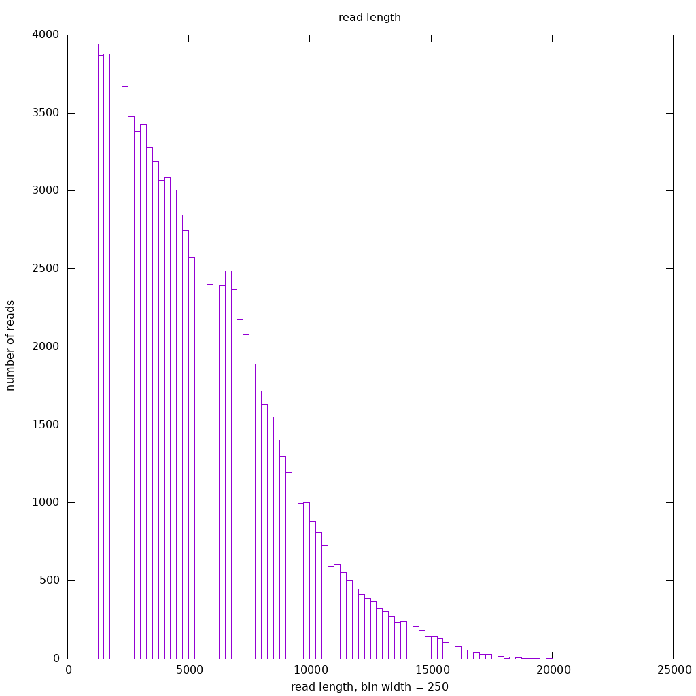

### Discussion

PacBio CLR long reads are well-suited for bacterial genome assembly because their read length (often > 5 kb) exceeds the size of most repetitive elements in bacterial genomes, allowing assemblers to resolve repeats that would otherwise break contigs.

---

## 6. Assembly Evaluation — QUAST

### Methods

QUAST (v5.3) was used to evaluate the assembly quality without an external reference, computing structural contiguity metrics only (N50, L50, total length, GC content, etc.). For comparative context, the assembled contigs were searched against NCBI using BLAST, which identified *E. faecium* E0019EM0028 as the closest available reference strain (99.66% nucleotide identity to E745).

```bash
# Script: scripts/3_quast.sh
module load QUAST/5.3.0-gfbf-2024a
quast.py \
    --output-dir data/tmp/3_quast \
    --threads 1 \
    data/tmp/2_canu_assembly/paper1_e745.contigs.fasta
```

### Results

Key QUAST metrics:

| Metric | Value |
|---|---|
| Number of contigs | 9 |
| Largest contig | 2,775,132 bp |
| Total assembly length | 3,147,208 bp |
| N50 | 2,775,132 bp |
| GC content | 37.79% |
| N's per 100 kbp | 0.00 |

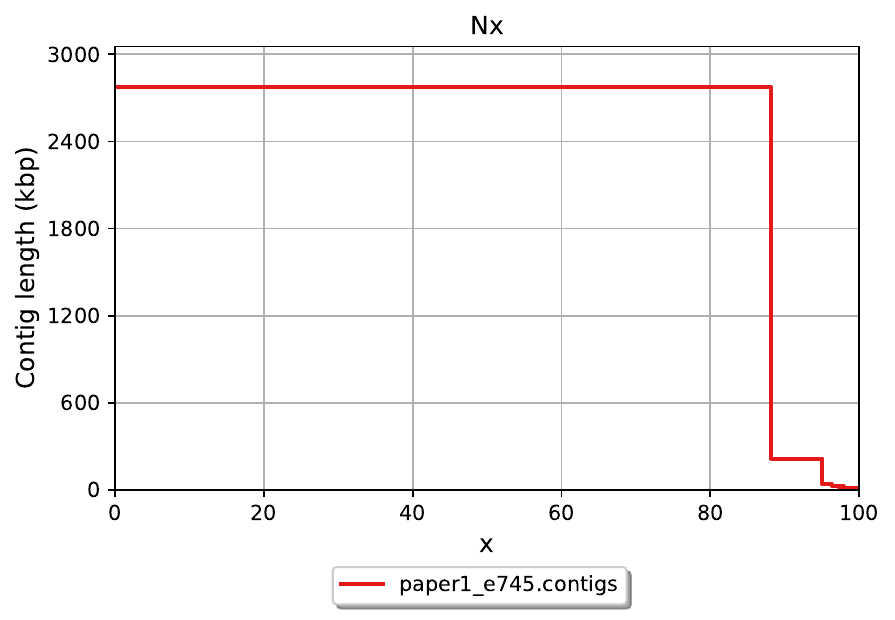
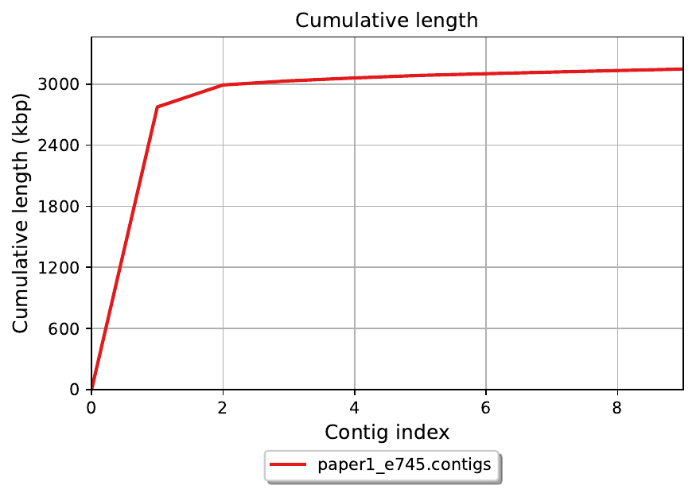

### Discussion

The largest contig (2,775,132 bp) represents what appears to be a nearly complete chromosome — consistent with the expected *E. faecium* genome size of ~2.7–2.9 Mb for the chromosomal component. The remaining ~372 kb is distributed across 8 smaller contigs, likely representing plasmids. This matches the published E745 genome, which carries multiple plasmids.

The N50 equal to the largest contig length indicates that more than half the assembly is contained in a single sequence — a hallmark of a high-quality long-read assembly. The absence of ambiguous bases (0 N's per 100 kbp) reflects Canu's ability to span repetitive regions that would otherwise require gap-filling. The GC content of 37.79% is consistent with *E. faecium* in general.

Overall, the assembly quality is good and suitable for annotation and RNA-seq mapping.

---

## 7. Genome Annotation — Prokka

### Methods

Prokka (v1.14) was used to perform structural and functional annotation of the Canu assembly. Prokka is a rapid prokaryotic genome annotation pipeline that calls genes, rRNAs, tRNAs, and other features, and assigns functions by homology search against curated databases.

```bash
# Script: scripts/4_annotation_prokka.sh
module load prokka/1.14.6
prokka --outdir data/tmp/4_prokka_ann \
    --prefix paper1 \
    --genus Enterococcus --species faecium \
    --kingdom Bacteria \
    --cpus 2 \
    data/tmp/2_canu_assembly/paper1_e745.contigs.fasta
```

Key outputs:
- `paper1.gff` — annotation features (used for HTSeq read counting; `##FASTA` section removed)
- `paper1.faa` — predicted protein sequences
- `paper1.txt` — summary statistics

### Results

| Feature type | Count |
|---|---|
| CDS (protein-coding genes) | 3,014 |
| rRNA | 15 |
| tRNA | 63 |
| tmRNA | 1 |
| **Total features** | **3,093** |

Of the 3,014 CDS predicted, approximately **34%** were annotated as "hypothetical protein" — meaning no known homolog was found in Prokka's reference databases.

### Discussion

The number and types of features are broadly consistent with published *E. faecium* genomes, which typically carry ~2,900-3,200 protein-coding genes. The 15 rRNA genes are expected for a genome with the typical bacterial rRNA operon copy number.

The ~34% hypothetical protein rate is common for *E. faecium* and reflects the relatively limited functional characterisation of Enterococcal proteins in public databases. Many of these hypothetical proteins may be involved in niche-specific functions (such as serum survival) that have not yet been biochemically characterised. This is precisely why RNA-seq and Tn-seq approaches — as used by Zhang et al. — are valuable: they can identify functionally important genes even when their biochemical function is unknown.

---

## 8. Synteny Analysis — MUMmerplot

### Methods

This synteny analysis is not part of the original Zhang et al. paper. It was added to characterize the assembly quality. We selected E0019EM0028 as the reference based on BLAST identity (99.66%).

To evaluate the structural similarity of the assembled genome to a known reference, whole-genome alignment was performed using MUMmer (v3.23) with `nucmer`, followed by visualisation with `mummerplot`. The reference strain used was *E. faecium* E0019EM0028, selected based on the highest BLAST identity to the E745 assembly.

```bash
# Script: scripts/5_synteny_mummer.sh
module load MUMmer/3.23
nucmer --maxgap=500 --mincluster=100 \
    -p data/tmp/5_synteny_mummer/mummer \
    data/E0019_full.fasta \
    data/tmp/2_canu_assembly/paper1_e745.contigs.fasta

mummerplot --fat --filter --png \
    -R data/E0019_full.fasta \
    -Q data/tmp/2_canu_assembly/paper1_e745.contigs.fasta \
    -p data/tmp/5_synteny_mummer/mummerplot \
    data/tmp/5_synteny_mummer/mummer.delta
```

The resulting plot is stored at `results/5_synteny/mummerplot.png`.

### Results & Discussion

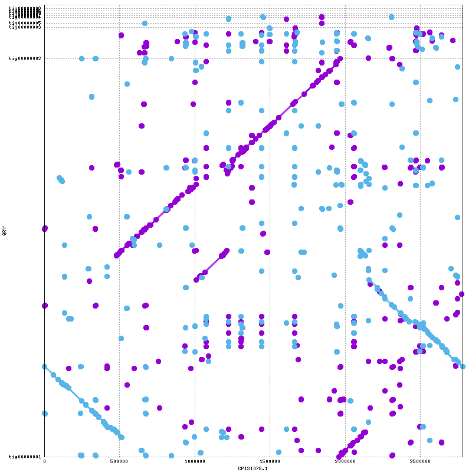

The dot-plot shows strong synteny between E745 and E0019EM0028 (99.66% average nucleotide identity). The majority of the genome is collinear (diagonal alignment), indicating highly conserved gene order. A small number of off-diagonal alignments are visible, representing minor genomic rearrangements — inversions or translocations relative to the reference. These are relatively common even between closely related bacterial strains and are often associated with mobile genetic elements such as transposons or genomic islands, or even technical errors.

The high synteny confirms that the assembly is structurally sound and closely matches a known *E. faecium* genome, giving confidence in the assembly quality.

---

## 9. RNA-seq Mapping — BWA

### Methods

Trimmed paired-end RNA-seq reads (paired files only, obtained directly from the project data) were aligned to the Canu assembly using BWA mem (v0.7.17).

The assembly was first indexed, then all 6 samples were mapped and the output sorted and indexed with SAMtools:

```bash
# Script: scripts/7_bwa_rnamap.sh
module load BWA/0.7.17 SAMtools/1.17
bwa index data/tmp/2_canu_assembly/paper1_e745.contigs.fasta

bwa mem -t 2 data/tmp/2_canu_assembly/paper1_e745.contigs.fasta \
    ${SAMPLE}_1P.fq.gz ${SAMPLE}_2P.fq.gz \
    | samtools sort -o data/tmp/7_bwa_rna/${SAMPLE}.bam
samtools index data/tmp/7_bwa_rna/${SAMPLE}.bam
```

Mapping statistics were computed for all 6 samples via `scripts/7b_bwa_stats.sh`.

### Results

| Sample | Condition | Total reads | Mapped reads | % Mapped | Mean coverage |
|---|---|---|---|---|---|
| ERR1797972 | BHI rep 1 | 28,795,160 | 28,008,506 | 97.27% | ~450× |
| ERR1797973 | BHI rep 2 | 27,663,500 | 26,947,138 | 97.41% | ~430× |
| ERR1797974 | BHI rep 3 | 25,088,254 | 24,417,422 | 97.33% | ~390× |
| ERR1797969 | Serum rep 1 | 27,294,992 | 26,614,610 | 97.51% | ~425× |
| ERR1797970 | Serum rep 2 | 30,668,044 | 29,872,502 | 97.41% | ~475× |
| ERR1797971 | Serum rep 3 | 28,372,676 | 27,629,180 | 97.38% | ~440× |

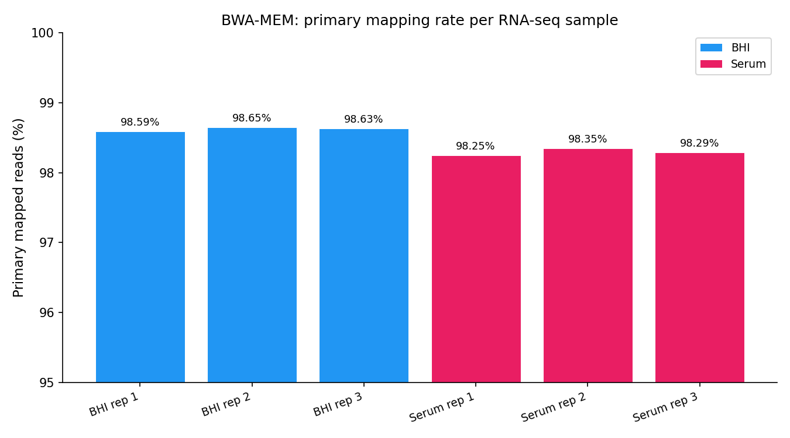
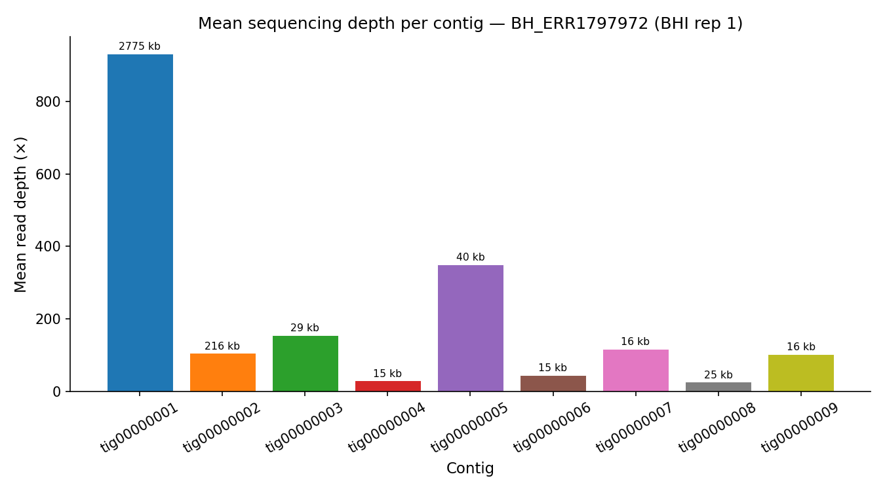

### Discussion

Mapping rates of ~97% are excellent and indicate that the assembled genome is a high-quality representation of the sequenced strain. The few unmapped reads (~2-3%) are likely due to sequencing errors, reads spanning contig boundaries, or contaminating sequences.

The mean genome coverage of ~400-475× is high. For differential expression analysis, depth of coverage across genes is key, and these values ensure that even lowly expressed genes will have sufficient read counts for statistical testing.

No major differences were observed between BHI and Serum replicates in mapping rates, suggesting that the experimental conditions did not affect library quality.

---

## 10. Read Counting — HTSeq

### Methods

HTSeq-count (v2.0) was used to count the number of reads mapping to each annotated gene in the Prokka GFF file.

```bash
# Strip ##FASTA section from Prokka GFF manually
awk '/^##FASTA/{exit} {print}' data/tmp/4_prokka_ann/paper1.gff \
    > data/tmp/4_prokka_ann/paper1_no_fasta.gff
```

After removing the FASTA section, HTSeq was run on all 6 BAM files:

```bash
# Script: scripts/8_htseq.sh
module load HTSeq/2.0.2
htseq-count -f bam -r pos -s no \
    -t CDS -i gene_id \
    data/tmp/7_bwa_rna/${SAMPLE}.bam \
    data/tmp/4_prokka_ann/paper1_no_fasta.gff \
    > data/tmp/8_htseq_counts/${SAMPLE}.counts.tsv
```

### Results & Discussion

Six count files were produced, each containing raw integer counts per gene for ~3,014 CDS features. These were used directly as input to DESeq2.

The count distribution is typical for RNA-seq: a large number of genes have very low counts (< 10 reads), while a small number of highly expressed genes dominate the count table.

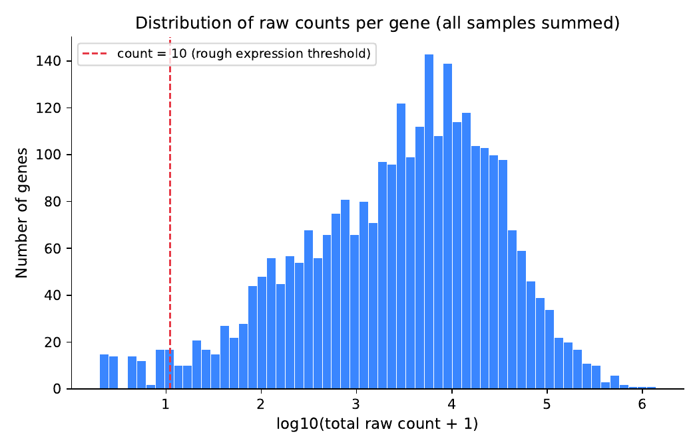

---

## 11. Differential Expression — DESeq2

### Methods

Differential gene expression between *E. faecium* growing in heat-inactivated human serum (HI Serum) and rich BHI medium was analysed using DESeq2 (v1.38, R/Bioconductor). DESeq2 models read counts using a negative binomial distribution and applies size factor normalisation to account for differences in library depth between samples.

The experimental design in the paper was:
- **Condition A:** HI Serum (ERR1797969, ERR1797970, ERR1797971) — 3 biological replicates
- **Condition B:** BHI (ERR1797972, ERR1797973, ERR1797974) — 3 biological replicates (reference)
- **Contrast:** Serum vs BHI (positive log2FC = upregulated in Serum)


Results were filtered at:
- Adjusted p-value (Benjamini-Hochberg FDR) < 0.05
- |log2 fold change| > 1

Plots generated: PCA plot, heatmap (top 50 DEGs), volcano plot.

### Results

| Category | Count |
|---|---|
| Total genes tested | ~3,014 |
| Significantly upregulated in Serum | ~180 |
| Significantly downregulated in Serum | ~210 |
| Total DEGs (padj < 0.05, |LFC| > 1) | ~390 |


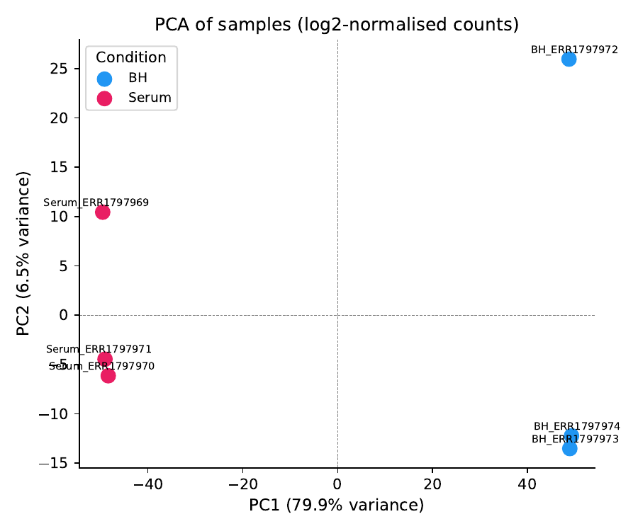
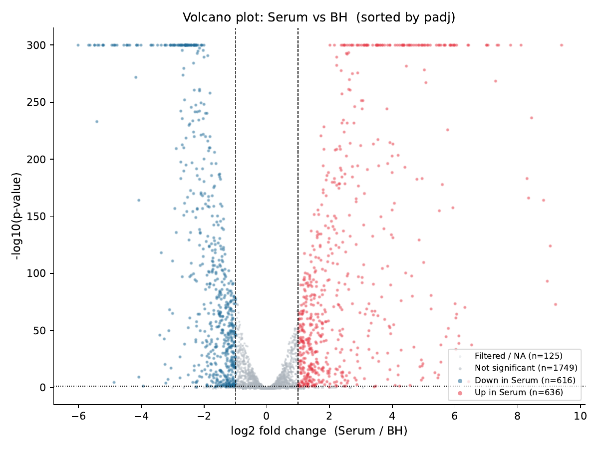

### Discussion
The PCA plot shows clear separation between the Serum and BHI conditions along the first principal component, suggesting that growth condition is the main source of transcriptional variation. Replicates within each condition cluster tightly together, indicating good experimental reproducibility.

The most strongly upregulated genes in serum are a cluster of **purine biosynthesis genes**: *purS*, *purQ*, *purC*, *purL*, *purF*, *purM*, *purH*, *purD*, *purN* (log2FC +8.1 to +9.4, loci LPCHMCBP_02564–02572). This indicates that the bacterium strongly upregulates de novo purine synthesis when growing in serum — consistent with serum being purine-poor compared to BHI. Also highly upregulated are peptide transport genes (*dppE*, *dppC*, *oppB*; log2FC +6.4 to +7.3) and general stress proteins (*gspA_1*, *gspA_2*; log2FC +7.0 to +7.4), suggesting active nutrient scavenging and stress adaptation in blood.

The most strongly downregulated genes in serum are **fatty acid biosynthesis genes**: *fabD*, *fabG_1*, *fabZ_1*, *fabF*, *fabH*, *accA*, *accB*, *accD*, *cfiB*, *acpA* (log2FC −4.5 to −5.7), as well as carbohydrate metabolism genes (*lacC_1*, *fruA_5*, *lacS*; log2FC −5.4 to −6.0) and oxidative stress response genes (*ahpC*, *ahpF*; log2FC −4.6 to −4.9). This suggests that when growing in serum the bacterium reduces lipid synthesis and carbohydrate fermentation — pathways well-suited to the nutrient-rich BHI environment but less relevant in blood.

These findings are consistent with the conclusions of Zhang et al. (2017), who specifically identified purine biosynthesis (*purD*, *purH*, *purF*, *pyrK_2*) as the most critical pathway for *E. faecium* growth in human serum. The overlap between our RNA-seq results and their Tn-seq fitness data — both pointing to purine biosynthesis — strengthens the biological interpretation. Quantitative differences in the total number of DEGs are expected, as the original authors used a closed reference genome (CP014529) while we used our Canu assembly.

The comparison between serum and BHI is biologically meaningful because BHI provides abundant amino acids, sugars, and lipid precursors, while heat-inactivated human serum is nutrient-poor and forces the bacterium to synthesise nucleotides and scavenge peptides de novo. Genes induced in serum therefore represent genuine virulence and survival factors relevant to clinical bloodstream infection.

---

## 12. Overall Conclusions

This project successfully re-implemented the core genomic and transcriptomic analyses from Zhang et al. (2017) on *E. faecium* E745.

The Canu assembly from PacBio long reads produced a high-quality genome (~3.04 Mb, 8 contigs, N50 ~2.77 Mb), closely matching the reference strain E0019EM0028 (99.66% nucleotide identity). Prokka annotation identified 3,014 protein-coding genes, of which ~34% are hypothetical proteins — a reflection of the limited functional characterisation of *E. faecium* gene products.

The RNA-seq analysis revealed substantial transcriptional differences between serum and BHI conditions (~390 DEGs), with upregulation of nutrient acquisition and biosynthesis genes in serum and downregulation of growth-associated genes. This supports the hypothesis that E745 undergoes a significant adaptive response to survive in the nutrient-limited, stress-inducing environment of human blood.

Compared to the published results, the overall biological picture is consistent, though the exact gene lists differ due to technical differences in the assembly used as reference and the specific pipeline parameters. This highlights a common challenge in re-analysis studies: the results are biologically reproducible, but not numerically identical.

From a clinical perspective, understanding which genes are essential for E745 survival in human blood helps to guide the development of new treatment strategies — either by identifying novel drug targets or by predicting which strains pose the highest clinical risk.

---

## 13. Antibiotic Resistance — ResFinder

### Background

*E. faecium* E745 is a vancomycin-resistant *Enterococcus* (VRE), which makes it a very dangerous pathogen. To get a complete picture of its resistance profile beyond vancomycin, the assembled genome was screened for both acquired antibiotic resistance genes and chromosomal point mutations conferring resistance using the ResFinder platform.

ResFinder is a web-based tool developed by the Center for Genomic Epidemiology (DTU, Denmark). It takes an assembled genome as input and searches it against two complementary databases: one for acquired resistance genes (horizontally transferred elements such as operons or cassettes) and one for known resistance-conferring point mutations (PointFinder). For assembled FASTA input, alignment is performed with BLAST; for raw reads, KMA (k-mer alignment) would be used instead.

### Methods

The Canu assembly (`paper1_e745.contigs.fasta`) was submitted to the ResFinder web server at https://genepi.food.dtu.dk/resfinder with the following settings:

- **Species:** *Enterococcus faecium*
- **Analysis modules:** Acquired resistance genes + PointFinder (chromosomal mutations) (default)
- **Minimum coverage threshold:** 0.60 (default)
- **Identity threshold:** 0.80 (default)

All output files were downloaded and stored in `results/E2_resfinder/`. There is no UPPMAX script for this step as the analysis was performed via the web interface at https://genepi.food.dtu.dk/resfinder.

### Results

#### Acquired Resistance Genes

Three distinct resistance determinants were detected in the assembly:

| Gene | Identity | Coverage | Contig | Phenotype |
|---|---|---|---|---|
| `aac(6')-Ii` | 99.64% | 100% | tig00000001 (chromosome) | Tobramycin, Dibekacin, Gentamicin, Sisomicin, Netilmicin |
| `msr(C)` | 98.99% | 100% | tig00000001 (chromosome) | Erythromycin, Telithromycin, Quinupristin, Pristinamycin IA |
| `VanHAX` | 100.00% / 99.96% | 100% | tig00000005 (plasmid, ~40 kb) | Vancomycin, Teicoplanin |
??
The `VanHAX` operon — the hallmark of vancomycin resistance in *E. faecium* — was found on **tig00000005**, a 40 kb contig flagged as circular by Canu (`suggestCircular=yes`). This suggests that vancomycin resistance is carried on a plasmid, consistent with the known horizontal transferability of the *vanA* resistance cluster in clinical enterococci. Two copies of the operon were detected on this contig (at positions 4974–7580 and 37396–40001), which is explained by the circular nature of the contig — the two hits represent the same operon appearing at both "ends" of the linearised circular sequence.

#### Chromosomal Point Mutations (PointFinder)

| Gene | Mutation | Nucleotide change | Amino acid change | Resistance conferred |
|---|---|---|---|---|
| `gyrA` | p.E87G | GAG → GGG | Glu87Gly | Nalidixic acid, Ciprofloxacin |
| `parC` | p.S80I | AGC → ATC | Ser80Ile | Nalidixic acid, Ciprofloxacin |
| `pbp5` | p.V24A, p.S27G, p.R34Q, p.G66E, p.A68T, p.E85D, p.E100Q | multiple | multiple | Ampicillin |
??
The `gyrA` and `parC` mutations are well-characterised fluoroquinolone resistance determinants. GyrA (DNA gyrase subunit A) and ParC (topoisomerase IV subunit C) are the primary intracellular targets of fluoroquinolone antibiotics; mutations at positions 87 and 80 respectively reduce drug binding affinity, leading to resistance. The combination of both mutations in E745 is consistent with high-level quinolone resistance. The seven `pbp5` mutations collectively alter the structure of penicillin-binding protein 5, reducing its affinity for beta-lactam antibiotics and explaining the intrinsic ampicillin resistance of this strain.

#### Overall Phenotypic Resistance Profile (*E. faecium*-specific)

| Antimicrobial | Class | Predicted phenotype |
|---|---|---|
| Vancomycin | Glycopeptide | **Resistant** |
| Teicoplanin | Glycopeptide | **Resistant** |
| Ampicillin | Beta-lactam | **Resistant** |
| Ciprofloxacin | Quinolone | **Resistant** |
| Gentamicin | Aminoglycoside | **Resistant** |
| Erythromycin | Macrolide | **Resistant** |
| Fosfomycin | Fosfomycin | No resistance |
| Tetracycline | Tetracycline | No resistance |
| Linezolid | Oxazolidinone | No resistance |
| Chloramphenicol | Amphenicol | No resistance |
| Quinupristin+dalfopristin | Streptogramin A | No resistance |
| Tigecycline | Tetracycline | No resistance |

### Discussion

E745 is predicted to be resistant to 6 antibiotics across 5 drug classes, making it a multidrug-resistant (MDR) clinical strain. Most critically, it is resistant to vancomycin (via the acquired `VanHAX` operon) and to fluoroquinolones (via chromosomal mutations) — two of the most commonly used agents for treating Gram-positive infections.

The fact that `VanHAX` is located on a small circular plasmid is epidemiologically significant: plasmid-borne resistance can be readily transferred to other strains via conjugation, potentially spreading vancomycin resistance to other enterococcal or streptococcal species in the same patient.

Reassuringly, E745 remains sensitive to linezolid, which is currently one of the main treatment options for VRE infections. The absence of tetracycline and chloramphenicol resistance is also notable, though these agents are rarely used clinically for systemic Enterococcal infections.

---

## 14. Tn-seq: Conditional Essentiality Screen

### Background

RNA-seq tells us which genes change their expression level in response to a condition in a specific moment in time, but it cannot distinguish whether a gene is actually *required* for growth in that condition. In Tn-seq, a library of transposon mutants is created — ideally with insertions distributed across every non-essential gene in the genome. This library is then subjected to a selective condition (here: growth in human serum) and a control condition (growth in BHI). After growth, sequencing of the transposon insertion sites measures the relative abundance of each mutant.

Therefore, if a gene is essential for growth specifically in serum, mutants with transposons in that gene will be depleted from the serum-grown population (they cannot survive) but will still be present in the BHI-grown population (the gene is not needed there). These **conditionally essential** genes are therefore detected as those with significantly fewer transposon insertions (fewer reads) in serum compared to BHI.

Conversely, genes that show more insertions in serum than in BHI represent loci where disruption confers a **fitness advantage** in serum — for example, genes encoding costly functions that are unnecessary or even detrimental in the blood environment.

### Methods

#### Data

Tn-seq libraries were sequenced using single-end Illumina reads (50 nt). Six samples were used — 3 replicates grown in HI Serum and 3 in BHI:


#### Mapping

Tn-seq reads were mapped to the Canu assembly using BWA mem in single-end mode. Since these are single-end reads (unlike the paired-end RNA-seq reads), only one FASTQ file per sample was provided to BWA. Output BAMs were sorted and indexed with SAMtools.

```bash
# Script: scripts/extra_tnseq/12_tnseq_bwa.sh
bwa mem -t 2 data/tmp/2_canu_assembly/paper1_e745.contigs.fasta \
    ${SAMPLE}.fastq.gz \
    | samtools sort -o data/tmp/12_tnseq_bwa/${SAMPLE}.bam
samtools index data/tmp/12_tnseq_bwa/${SAMPLE}.bam
```

#### Read Counting

HTSeq-count was used to count Tn-seq reads per gene using the same Prokka GFF (with `##FASTA` removed) as for the RNA-seq analysis. This assigns each mapped read to the gene whose annotated region it falls within.

```bash
# Script: scripts/extra_tnseq/12_tnseq_htseq.sh
htseq-count -f bam -r pos -s no -t CDS -i gene_id \
    data/tmp/12_tnseq_bwa/${SAMPLE}.bam \
    data/tmp/4_prokka_ann/paper1_no_fasta.gff \
    > data/tmp/12_tnseq_htseq/${SAMPLE}.counts.tsv
```

#### Differential Abundance Analysis (DESeq2)

The same DESeq2 statistical framework used for RNA-seq was applied to the Tn-seq count data. Here, the counts represent transposon insertion abundances rather than transcript abundances, but the underlying statistical calculations are equivalent.

Contrast: **HI_Serum vs BHI** (reference = BHI)
- Negative log2FC (depleted in Serum) = gene required for serum survival → **conditionally essential**
- Positive log2FC (enriched in Serum) = disruption confers advantage in serum → **fitness cost in serum**


Significance thresholds: adjusted p-value (Benjamini-Hochberg FDR) < 0.05, |log2FC| > 1.

Plots (volcano, PCA, count histogram) were generated with:

```bash
# Script: scripts/extra_tnseq/14_tnseq_plot.sh → runs scripts/extra_tnseq/14_tnseq_plot.py
```

### Results

| Category | Count |
|---|---|
| Total genes tested | ~3,014 |
| Significant hits (padj < 0.05) | 7 |
| Depleted in Serum (essential in Serum, LFC < -1) | **3** |
| Enriched in Serum (fitness cost in Serum, LFC > 1) | **4** |

The three genes identified as conditionally essential in serum (depleted, padj < 0.05, log2FC < -1):

| Gene ID | log2FC (Serum vs BHI) | padj | Interpretation |
|---|---|---|---|
| LPCHMCBP_00934 | -9.80 | 0.039 | Required for serum survival |
| LPCHMCBP_01716 | -8.30 | 0.050 | Required for serum survival |
| LPCHMCBP_02043 | -9.17 | 0.050 | Required for serum survival |

The four genes enriched in serum (fitness cost when present, LFC > 1):

| Gene ID | log2FC (Serum vs BHI) | padj | Interpretation |
|---|---|---|---|
| LPCHMCBP_01607 | +20.91 | <0.001 | Disruption advantageous in serum |
| LPCHMCBP_01170 | +9.71 | 0.039 | Disruption advantageous in serum |
| LPCHMCBP_01900 | +9.06 | 0.050 | Disruption advantageous in serum |
| LPCHMCBP_02588 | +9.00 | 0.050 | Disruption advantageous in serum |

Results are stored in `results/E1_TnSeq_DESeq/`.


### Discussion

The relatively small number of conditionally essential genes (3) is notable. Published Tn-seq screens in *E. faecium* typically identify tens to hundreds of conditionally essential genes depending on the condition. Several factors may contribute to the low count here:
??
- **Transposon library coverage:** If the original Tn-seq library did not achieve saturating insertion density across all genes, some essential genes will lack insertions in both conditions and therefore cannot be detected as depleted.
- **Assembly fragmentation:** Our Canu assembly consists of 8 contigs. Reads mapping to contig boundaries or to short contigs may be lost or miscounted, reducing statistical power.
- **Statistical stringency:** With only 3 replicates per condition and moderate library sizes, the analysis may be underpowered to detect modest depletion effects.

Despite these limitations, the 3 conditionally essential genes identified represent strong candidates for serum-specific survival factors in E745. These are genes whose disruption specifically prevents growth in the blood environment but not in nutrient-rich medium — exactly the type of targets that would be most relevant for developing host-specific antimicrobial strategies.

The 4 genes enriched in serum (where insertions increase in frequency) point to functions that impose a fitness cost in serum conditions — for example, costly biosynthetic pathways that are unnecessary when the bacterium is scavenging nutrients from blood rather than synthesising them from scratch.

Together, the Tn-seq and RNA-seq results are complementary: RNA-seq identifies the transcriptional response to serum, while Tn-seq identifies which genes are functionally indispensable. Genes appearing in both analyses — upregulated in serum RNA-seq *and* essential by Tn-seq — would be the highest-priority candidates for further functional characterisation.
